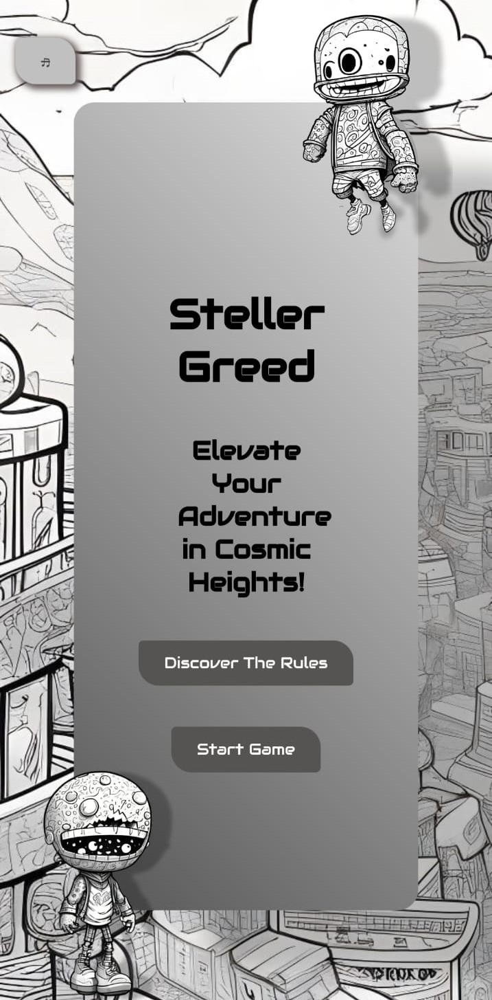

> # Steller Greed

Embark on an interstellar adventure with Steller Greed, a game that draws inspiration from the thrilling side-scrolling aerial combat of EverWing. In Steller Greed, you'll guide your stellar through cosmic heights, avoiding obstacles, and satisfying its insatiable greed.

> ## Features

- **Differnet Stellers:** Choose your own Steller. Everyone has a unique taste!

- **Different Maps:** Propel your steller through cosmic heights. You choose the map and your play ground.

> ## Technologies Used

- **Languages:** HTML, CSS, JavaScript
- **Development Environment:** VsCode
- **Design:** Figma
- **Browser Compatibility:** Google Chrome

> ## Figma Prototype

Explore the Figma prototype for Steller Greed: [Steller Greed Figma Prototype](https://www.figma.com/file/318i3gK82wlEg4Kf2sSQQV/stellerGreed-ProtoType?type=design&node-id=0%3A1&mode=design&t=Hf60QPyEjnVZaUOP-1)

> ## GitHub Repository

Checkout the Code: [Steller Greed GitHub Repo](https://github.com/Sujal-Shresth/stellerGreed)

> ## Deployed Game

Play Steller Greed now: [Steller Greed Deployed](https://sujal-shresth.github.io/stellerGreed/)

> ## Design Credits

- **Design Prototype:** Figma
- **Image Generation:** wepik AI image generator

> ## References

- **Documentation:** MDN webDocs, W3School
- **Community Support:** Stack Overflow
- **Support:** ChatGPT
- **Inspiration:** EverWing

> ## Screenshots

- **Mobile View**

  
  

- **Tablet View**

  
  

- **DeskTop View**

  
  

> Happy gaming! 🚀✨
